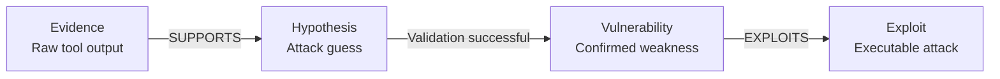

LuaN1aoAgent rejects blind exploration and LLM hallucinations. Instead, every testing decision is grounded in an explicit **causal graph** — a directed graph that records how raw observations lead to hypotheses, how hypotheses lead to confirmed vulnerabilities, and how vulnerabilities lead to exploit attempts.

<Note>
  The causal graph is separate from the task planning DAG. The task graph tracks *what to do*; the causal graph tracks *what was learned and why*.
</Note>

## Why Causal Graphs Prevent Hallucinations

Without a causal graph, an LLM agent can:
- Jump to exploit an SQLi vulnerability it invented without any supporting evidence.
- Repeatedly retry a failed technique because it forgot why the previous attempt failed.
- Report a finding it never actually observed.

The causal graph enforces three constraints:

1. **Evidence first** — a `Hypothesis` node cannot exist without at least one `Evidence` node that `SUPPORTS` it.
2. **Confidence quantification** — every causal edge carries a numeric confidence score, preventing advancement on weak guesses.
3. **Full traceability** — every node records the `source_step_id` of the execution step that produced it, creating an auditable reasoning chain.

---

## Node Types

All causal node types are defined as dataclasses in `core/data_contracts.py`, inheriting from `BaseCausalNode`:

```python
@dataclass
class BaseCausalNode:
    """
    Base class for all causal graph nodes.

    Attributes:
        id:             Unique node identifier (auto-generated UUID if empty)
        source_step_id: ID of the execution step that produced this node
        traceability:   Human-readable traceability notes
        node_type:      Set automatically by each subclass
    """
    id: str
    source_step_id: Optional[str]
    traceability: Optional[str]
    node_type: str = field(init=False)
```

<AccordionGroup>
  <Accordion title="Evidence">
    Raw facts from tool execution. Anchors the entire reasoning chain.

    ```python
    class EvidenceNode(BaseCausalNode):
        tool_name: str           # e.g., "nmap", "http_request"
        raw_output: str          # full tool output
        extracted_findings: Dict # structured key-value extraction
        host: Optional[str]
        port: Optional[int]
    ```

    **Example**: nmap reports `3306/tcp open mysql`.
  </Accordion>
  <Accordion title="Hypothesis">
    An inference drawn from evidence. Carries a dynamic confidence score and verification lifecycle.

    ```python
    @dataclass
    class HypothesisNode(BaseCausalNode):
        description: str
        confidence: float  # 0.0 to 1.0
        status: Literal["SUPPORTED", "FALSIFIED", "PENDING", "CONTRADICTED"]
        preconditions: List[str]
        potential_impact: Optional[str]
        verification_steps: List[str]
    ```

    **Example**: "Target is running MySQL and may accept unauthenticated connections."
  </Accordion>
  <Accordion title="Vulnerability / PossibleVulnerability / ConfirmedVulnerability">
    Represents an identified security weakness, at varying levels of certainty.

    ```python
    @dataclass
    class VulnerabilityNode(BaseCausalNode):
        description: str
        cvss_score: Optional[float]
        exploitation_conditions: List[str]
        known_exploits: List[str]
    ```

    `ConfirmedVulnerability` nodes receive special treatment — they get `confidence: 0.99` and `status: "CONFIRMED"` automatically, and the bulletin board broadcasts them to all parallel subtasks immediately.
  </Accordion>
  <Accordion title="Exploit">
    An executable attack vector targeting a specific vulnerability.

    ```python
    @dataclass
    class ExploitNode(BaseCausalNode):
        vulnerability_id: str    # links to the VulnerabilityNode
        description: str
        exploit_payload: str     # complete, directly usable payload
        expected_outcome: str    # success indicator
        exploit_type: str        # e.g., 'sqli', 'rce', 'auth_bypass'
    ```

    **Example**: `mysql -h target -u root -p ''` against a MySQL weak-password vulnerability.
  </Accordion>
  <Accordion title="KeyFact">
    A factual observation that does not fit the Evidence-Hypothesis chain but is worth tracking (e.g., a server version string, a discovered admin URL).

    KeyFact nodes with confidence ≥ 0.5 are broadcast to the shared bulletin board for parallel subtasks.
  </Accordion>
</AccordionGroup>

---

## Edge Types

Edges represent the logical relationship between two causal nodes. The `GraphManager` normalizes all edge labels to a canonical set:

```python
# From core/graph_manager.py
def _standardize_edge_label(self, label: str) -> str:
    mapping = {
        "SUPPORT": "SUPPORTS",    "CONFIRMS": "SUPPORTS",
        "CONTRADICT": "CONTRADICTS", "DISPROVES": "CONTRADICTS",
        "REVEAL": "REVEALS",
        "EXPLOIT": "EXPLOITS",
        "MITIGATE": "MITIGATES",
    }
    return mapping.get(norm, norm)
```

| Edge Label | Semantics |
|---|---|
| `SUPPORTS` | Source evidence or hypothesis strengthens confidence in target |
| `CONTRADICTS` | Source evidence or hypothesis weakens or falsifies target |
| `REVEALS` | Source step or evidence exposes the existence of target |
| `EXPLOITS` | An Exploit node targets a Vulnerability node |
| `MITIGATES` | A protection mechanism reduces confidence in an Exploit path |

```python
@dataclass
class CausalEdge:
    source_id: str
    target_id: str
    label: Literal["SUPPORTS", "CONTRADICTS", "REVEALS", "EXPLOITS", "MITIGATES"]
    description: Optional[str] = None
```

---

## The Evidence-Hypothesis-Validation Chain

The canonical reasoning chain that LuaN1aoAgent builds for every attack path:



**Concrete example from README**:

```
Evidence:    Port scan discovers 3306/tcp open
  ↓ (confidence 0.8, SUPPORTS)
Hypothesis:  Target runs MySQL service
  ↓ (validation successful)
Vulnerability: MySQL weak password / unauthorized access
  ↓ (attempt exploitation)
Exploit:     mysql -h target -u root -p [empty password]
```

---

## Confidence Propagation

The `update_hypothesis_confidence` method in `core/graph_manager.py` implements **non-monotonic logic propagation** — meaning evidence can both raise and lower confidence, and decisive evidence overrides accumulated weak evidence.

```python
def update_hypothesis_confidence(
    self,
    hypothesis_id: str,
    label: str,
    evidence_strength: str = None,
    evidence_type: str = None
):
    """
    Non-Monotonic Logic Propagation.

    Distinguishes necessary evidence (veto/confirm power) from
    contingent evidence (Sigmoid accumulation). This is the core
    mechanism of the abductive reasoning framework, avoiding
    Bayesian dependence on prior probabilities.
    """
```

Evidence is classified into two strength tiers:

<Tabs>
  <Tab title="NECESSARY evidence">
    A single decisive piece of evidence that conclusively confirms or refutes a hypothesis. The LLM can flag evidence as `"necessary"`, `"decisive"`, `"conclusive"`, or `"definitive"`.

    - `SUPPORTS` → confidence set to `1.0`, status becomes `CONFIRMED`
    - `CONTRADICTS` → confidence set to `0.0`, status becomes `FALSIFIED`

    ```python
    if strength == EvidenceStrength.NECESSARY:
        if label == "CONTRADICTS":
            new_confidence = 0.0
            new_status = "FALSIFIED"
        else:  # SUPPORTS
            new_confidence = 1.0
            new_status = "CONFIRMED"
    ```
  </Tab>
  <Tab title="CONTINGENT evidence">
    Cumulative evidence that shifts confidence non-linearly using a **Sigmoid (logit) transform**. This avoids confidence racing to the boundary too quickly.

    ```python
    # Sigmoid non-linear accumulation
    delta = 0.4 if label == "SUPPORTS" else -0.5
    clamped_conf = max(0.01, min(0.99, current_confidence))
    logit = math.log(clamped_conf / (1 - clamped_conf))
    new_logit = logit + delta
    new_confidence = 1 / (1 + math.exp(-new_logit))
    # Prevent extremes
    new_confidence = max(0.05, min(0.95, new_confidence))
    ```
  </Tab>
</Tabs>

<Note>
  The LLM's explicit `evidence_strength` parameter takes priority. If not provided, the system defaults to `CONTINGENT` (conservative).
</Note>

---

## Staged Nodes and Node Promotion

The Executor does not write directly to the causal graph. Instead, it **stages** proposed nodes on its subtask node:

```python
# From core/executor.py — Executor stages nodes during execution
if artifact_proposals:
    graph_manager.stage_proposed_causal_nodes(subtask_id, artifact_proposals)
```

The staging area uses **tiered priority storage** (from `core/graph_manager.py`):

```python
# P3-2: Tiered artifact storage — high-priority nodes (ConfirmedVulnerability/KeyFact)
# are never evicted; low-priority nodes can be dropped when the 30-slot limit is reached.
MAX_STAGED_NODES = 30
HIGH_PRIORITY_TYPES = {"ConfirmedVulnerability", "KeyFact"}
```

The **Reflector** then reviews staged nodes and either:
- **Promotes** them into the causal graph via `causal_graph_updates`
- **Vetoes** them using `rejected_staged_nodes`, which removes them from the task graph entirely

---

## The `query_causal_graph` Tool

The Executor can query the live causal graph without going through MCP. This is implemented as a local tool handler with zero latency:

```python
# From core/executor.py — P3-1: Local tool handling
_LOCAL_TOOLS = {"query_causal_graph"}

async def _handle_local_tool(
    tool_name: str, tool_params: dict, graph_manager: GraphManager
) -> str:
    if tool_name == "query_causal_graph":
        node_type_filter: str = tool_params.get("node_type", "")
        query: str           = tool_params.get("query", "")
        limit: int           = int(tool_params.get("limit", 10))

        results = []
        for node_id, data in graph_manager.causal_graph.nodes(data=True):
            nt = data.get("node_type", "")
            if node_type_filter and nt != node_type_filter:
                continue
            text = " ".join(filter(None, [
                data.get("title", ""), data.get("description", ""),
                data.get("vulnerability", ""), data.get("hypothesis", ""),
            ])).lower()
            if query and query.lower() not in text:
                continue
            results.append({...})
```

**Example call** from an Executor step:

```json
{
  "tool": "query_causal_graph",
  "params": {
    "node_type": "Hypothesis",
    "query": "mysql",
    "limit": 5
  }
}
```

Returns all Hypothesis nodes whose text fields contain "mysql", with their current confidence and status — letting the Executor check what is already known before crafting the next tool call.

---

## How the Planner Uses the Causal Graph

At every planning cycle, `GraphManager.get_causal_graph_summary()` produces a text snapshot of the causal graph that is injected directly into the Planner's prompt:

```python
def get_causal_graph_summary(self) -> str:
    summary_lines = ["## Causal Graph Summary", "\n## Node Overview"]
    for node_id, data in self.causal_graph.nodes(data=True):
        node_type = data.get("node_type", ...)
        if node_type == "Evidence":
            summary_lines.append(f"- [Evidence] {node_id} · tool={tool} · findings={findings}")
        elif node_type == "Hypothesis":
            summary_lines.append(f"- [Hypothesis] {node_id} · {desc} · conf={conf} · status={status}")
        elif node_type in {"Vulnerability", "ConfirmedVulnerability", ...}:
            summary_lines.append(f"- [Vuln:{node_type}] {node_id} · CVSS={cvss}")
```

The Planner also receives the output of `analyze_attack_paths()`, which ranks full `Evidence → Hypothesis → Vulnerability` chains by combined confidence score and CVSS severity:

```python
# Attack path score = product(hypothesis confidences) × (cvss_score / 10.0)
final_score = path_score * (cvss_score / 10.0)
```

This ensures the Planner prioritizes high-confidence, high-severity attack paths rather than speculating about unexplored areas.
