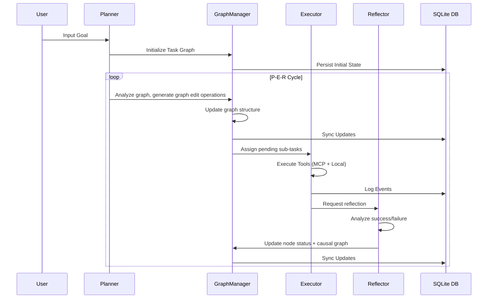

LuaN1aoAgent decouples penetration testing thinking into three independent yet collaborative cognitive roles: the **Planner**, the **Executor**, and the **Reflector**. Together they form a complete cognitive loop — planning, execution, and reflection — that prevents the "split personality" problem common in single-agent systems.

## Overview

Each role in the P-E-R framework focuses exclusively on its core responsibility. They share state through the `GraphManager` and communicate asynchronously via the `EventBroker`. This division of labor means no single LLM call must simultaneously reason about strategy, tool invocation, and audit.

```
┌─────────────────────────────────────────────────────────┐
│              P-E-R Cognitive Layer                      │
│  ┌──────────┐      ┌──────────┐      ┌──────────┐      │
│  │ Planner  │ ───> │ Executor │ ───> │Reflector │      │
│  │          │      │          │      │          │      │
│  └──────────┘      └──────────┘      └──────────┘      │
│       │                  │                  │            │
│       └──────────────────┴──────────────────┘            │
│                         ▲                                │
│                         │  EventBroker                   │
└─────────────────────────┴────────────────────────────────┘
```

<CardGroup cols={3}>
  <Card title="Planner" icon="brain">
    Strategic Brain. Decomposes goals into DAG task graphs and emits structured graph editing instructions.
  </Card>
  <Card title="Executor" icon="bolt">
    Tactical Engine. Executes individual subtasks via MCP tool calls, manages context, and discovers new evidence.
  </Card>
  <Card title="Reflector" icon="magnifying-glass">
    Audit and Learn. Reviews execution logs, validates findings, generates attack intelligence, and controls termination.
  </Card>
</CardGroup>

---

## The Planner

The `Planner` class in `core/planner.py` is the strategic brain of the agent. It never directly invokes tools; instead, it emits **graph operation instructions** that tell the `GraphManager` how to evolve the task graph.

### Graph Operation Outputs

The Planner's output is always a `graph_operations` list. Each item is one of:

| Command | Effect |
|---|---|
| `ADD_NODE` | Creates a new subtask in the DAG with description, dependencies, priority, and completion criteria |
| `UPDATE_NODE` | Modifies a subtask's metadata or status |
| `DEPRECATE_NODE` | Marks a subtask as abandoned (e.g., a dead-end attack path) |
| `DELETE_NODE` | Removes a subtask entirely |

```python
# From core/planner.py — sanitize_graph_operations enforces immutability rules
def _sanitize_graph_operations(
    self, ops: List[Dict], completed_node_ids: set = None
) -> List[Dict]:
    """
    Sanitizes graph operation instructions: deduplicates ADD_NODE,
    and code-layer protects completed nodes from being modified or deprecated.
    Illegal UPDATE_NODE operations are not silently dropped — a warning is
    recorded and injected into the next LLM context for visible feedback.
    """
```

<Warning>
  Completed nodes are immutable. The Planner's sanitizer intercepts any `DEPRECATE_NODE` or `DELETE_NODE` targeting a `completed` subtask and injects a violation warning back into the next planning context. To extend completed work, use `ADD_NODE` with a dependency reference.
</Warning>

### Adaptive Step Allocation

Each subtask node carries an optional `max_steps` field. The Planner uses this to allocate extra execution budget for complex tasks (e.g., blind SQL injection data extraction, multi-stage WAF bypass).

### Parallel Scheduling

The Planner identifies parallelizable tasks by analyzing DAG topology — subtasks with no mutual dependency are scheduled to run concurrently. This is purely structural: the Planner does not need to enumerate independent paths explicitly; the `GraphManager`'s topological traversal handles it.

### Dynamic Replanning

In addition to the initial plan, the Planner performs **dynamic replanning** after each Reflector cycle:

```python
# From core/planner.py
async def dynamic_plan(
    self,
    goal: str,
    graph_summary: str,
    intelligence_summary: Optional[Dict[str, Any]],
    causal_graph_summary: str = "",
    failure_patterns_summary: Dict[str, Any] = None,
    graph_manager=None,
    planner_context=None,
) -> tuple[Dict[str, Any], Dict]:
    """Performs adaptive replanning based on intelligence summary."""
```

When failed or blocked nodes exist, the Planner automatically builds a `failed_tasks_summary` and injects it into the prompt with high priority:

```python
failed_tasks_list.append(
    f"- Task ID: {node_id}, Status: {data.get('status')}, "
    f"Description: {data.get('description')}"
)
failed_tasks_summary = (
    "### High Priority: Failed/Blocked Tasks\n"
    "You MUST prioritize the following failed or blocked tasks. "
    "Design diagnostic subtasks or alternatives for them.\n"
    + "\n".join(failed_tasks_list)
)
```

### Branch Regeneration

For catastrophically failed branches, `regenerate_branch_plan` creates an entirely new subgraph to replace the dead branch. It cleans up dependencies pointing into the dead branch and re-anchors new nodes to healthy predecessors:

```python
async def regenerate_branch_plan(
    self, goal: str, graph_manager, failed_branch_root_id: str, failure_reason: str
) -> tuple[List[Dict], Dict]:
    """Generates an alternative plan for a failed branch."""
```

---

## The Executor

The `run_executor_cycle` function in `core/executor.py` implements the core tool-invocation loop for a single subtask. It runs until the subtask completes, stalls, or exhausts its step budget.

### Tool Invocation and Parallel Execution

Each LLM turn may return multiple `EXECUTE_NOW` operations. These are dispatched in parallel using `asyncio.gather`:

```python
# From core/executor.py — tools run concurrently per turn
tool_results = await asyncio.gather(*execution_tasks, return_exceptions=True)
```

Tools reach the agent via MCP (Model Context Protocol). Local tools (currently `query_causal_graph`) bypass MCP entirely for zero-latency lookups:

```python
_LOCAL_TOOLS = {"query_causal_graph"}

async def _handle_local_tool(
    tool_name: str, tool_params: dict, graph_manager: GraphManager
) -> str:
    """Handles tools that don't go through MCP. Currently: query_causal_graph."""
```

### Context Compression

To prevent token overflow on long-running subtasks, the Executor applies a three-tier compression strategy:

<Steps>
  <Step title="Message count threshold">
    Triggers when message history exceeds `EXECUTOR_MESSAGE_COMPRESS_THRESHOLD`.
  </Step>
  <Step title="Periodic compression">
    Triggers every `EXECUTOR_COMPRESS_INTERVAL` steps when history is large enough.
  </Step>
  <Step title="Token estimation">
    Triggers when estimated tokens (chars ÷ 4) exceed `EXECUTOR_TOKEN_COMPRESS_THRESHOLD`.
  </Step>
</Steps>

When compression fires, older messages are summarized via `llm.summarize_conversation`, and the system message plus recent messages are preserved:

```python
compressed_message = {
    "role": "system",
    "content": f"📊 Smart context summary (compressed from "
               f"{len(messages_to_compress)} historical messages):\n\n{compressed_summary}",
}
messages = [system_prompt_msg, compressed_message]
messages.extend(recent_messages)
```

### Hypothesis Persistence

Outputs from the `formulate_hypotheses` tool are **persisted across context compression** by writing them directly into the subtask node:

```python
# From core/executor.py — P1-1: Hypothesis persistence across steps
if tool_name == "formulate_hypotheses" and step_status == "completed":
    new_hypotheses = hyp_result.get("hypotheses_record", {}).get("hypotheses", [])
    if new_hypotheses:
        graph_manager.update_node(subtask_id, {"active_hypotheses": new_hypotheses})
```

### Shared Bulletin Board (Parallel Discovery Sharing)

When multiple subtasks run in parallel, high-value findings are shared in real-time via `GraphManager.shared_findings`:

```python
# From core/executor.py — P1-2: Reads new findings from other parallel subtasks
new_findings = graph_manager.get_new_shared_findings(subtask_id)
if new_findings:
    bulletin_msg = (
        f"📢 [Shared Bulletin] {len(new_findings)} new clues from other parallel subtasks "
        "(staged, not yet Reflector-audited — treat as reference, not confirmed fact):\n"
        + "\n".join(bulletin_lines)
    )
    messages.append({"role": "user", "content": bulletin_msg})
```

Only `ConfirmedVulnerability` nodes (unconditionally) and `KeyFact` nodes with confidence ≥ 0.5 are broadcast to the bulletin board.

### First-Step Guidance

On step 0, if the causal graph contains no `ConfirmedVulnerability` nodes, the Executor injects a soft prompt to encourage the agent to call `formulate_hypotheses` before exploring:

```python
if executed_steps_count == 0:
    has_confirmed_vuln = any(
        d.get("node_type") == "ConfirmedVulnerability"
        for _, d in graph_manager.causal_graph.nodes(data=True)
    )
    if not has_confirmed_vuln:
        messages.append({
            "role": "user",
            "content": (
                "💡 [Suggestion] This is your first step. No ConfirmedVulnerability node exists yet. "
                "Consider calling `formulate_hypotheses` to clarify your attack hypotheses."
            ),
        })
```

### Fault Tolerance and Termination

The Executor handles three termination conditions:

| Condition | Status |
|---|---|
| LLM signals `is_subtask_complete: true` | `completed` |
| Step count reaches `effective_max_steps` | `completed` (soft limit) |
| `EXECUTOR_NO_ARTIFACTS_PATIENCE` steps with no new `staged_causal_nodes` | terminates with `no_new_artifacts` |

Transient network errors (timeouts, connection drops, JSON parse errors) are retried up to 3 times with a 5-second delay via `_execute_with_retry`.

---

## The Reflector

The `Reflector` class in `core/reflector.py` acts as the audit and learning layer. It runs after each Executor cycle and performs both **per-subtask reflection** and a final **global reflection** if the mission succeeds.

### Per-Subtask Reflection

The `reflect` method reviews the execution log, validates staged causal nodes, and emits structured intelligence:

```python
async def reflect(
    self,
    subtask_id: str,
    subtask_data: Dict,
    status: str,
    execution_log: str,
    proposed_changes: List[Dict],
    staged_causal_nodes: List[Dict],
    causal_graph_summary: str,
    dependency_context: Optional[List[Dict]] = None,
    graph_manager=None,
    reflector_context=None,
) -> Dict:
    """Executes reflection and audit."""
```

### Failure Pattern Analysis (L1–L4)

The Reflector calls `graph_manager.analyze_failure_patterns()` to detect three structural problem classes in the causal graph:

<AccordionGroup>
  <Accordion title="Contradiction Clusters">
    A hypothesis has multiple pieces of contradicting evidence (e.g., one scan says port 3306 open, another says filtered). Requires the Planner to design a discriminating probe task.
  </Accordion>
  <Accordion title="Stalled Hypotheses">
    A hypothesis has been in `PENDING` or `SUPPORTED` state for longer than a time window with no new supporting or contradicting evidence. Indicates the exploration has stalled.
  </Accordion>
  <Accordion title="Competing Hypotheses">
    A single piece of evidence supports or contradicts multiple hypotheses simultaneously, creating explanation ambiguity. Requires abductive reasoning to identify the best explanation.
  </Accordion>
</AccordionGroup>

### Veto Power

The Reflector can explicitly reject staged causal nodes that do not meet its validation criteria:

```python
# From core/reflector.py — VETO LOGIC
rejected_nodes = reflection_data.get("rejected_staged_nodes", [])
if rejected_nodes and graph_manager:
    for node_id in rejected_nodes:
        if graph_manager.graph.has_node(node_id):
            graph_manager.delete_node(node_id)
        # Also removes the node from causal_graph_updates to prevent re-addition
```

### Intelligence Generation

On success, `reflect_global` produces a structured STE (Strategy-Tactic-Example) insight:

```python
async def reflect_global(self, graph_manager: GraphManager) -> Dict:
    """Produces highest-level strategic analysis and reusable STE experience."""
    if not graph_manager.is_goal_achieved():
        return {"global_summary": "Task not successful, skipping global experience archiving."}
    simplified_graph = graph_manager.get_simplified_graph()
    prompt = self._generate_global_reflector_prompt(simplified_graph)
    # ...
```

The output format enforces:
- `strategic_principle` — a one-sentence attack principle
- `tactical_playbook` — an ordered list of abstract tactical steps
- `applicability` — tags for future reuse matching

### Termination Control

The Reflector is the authoritative judge of whether a task is complete. It calls `_evaluate_success_with_llm` to make a binary verdict based on natural-language completion criteria:

```python
async def _evaluate_success_with_llm(
    self, completion_criteria: str, execution_log: str
) -> bool:
    prompt = f"""
    You are a strict penetration testing result auditor.
    - Task completion criteria: "{completion_criteria}"
    - Execution log: "{execution_log}"
    Has the criteria been clearly and unambiguously met?
    Answer only "true" or "false".
    """
```

---

## P-E-R Collaboration Flow

The full cycle, from goal input to termination, follows this sequence:



## EventBroker

All three components communicate via the global `EventBroker` singleton defined in `core/events.py`. It implements a pub-sub model with per-`op_id` queues:

```python
# From core/events.py
class EventBroker:
    """
    Implements event publish-subscribe for real-time communication between
    agent components and the Web visualization service.
    Supports multiple subscribers, async event streams, and operation-level separation.
    """

    async def emit(
        self, event: str, payload: Dict[str, Any], op_id: Optional[str] = None
    ) -> None: ...

    async def subscribe(
        self, op_id: str, replay_buffered: bool = True
    ) -> AsyncIterator[Dict[str, Any]]: ...

broker = EventBroker()
```

Key events emitted during a cycle:

| Event | Emitter | Meaning |
|---|---|---|
| `planning.initial.completed` | Planner | Initial graph operations generated |
| `planning.dynamic.completed` | Planner | Dynamic replanning operations generated |
| `execution.step.completed` | Executor | A tool call finished |
| `execution.halt` | Executor | External halt signal detected |
| `reflection.completed` | Reflector | Subtask audit finished |
| `graph.changed` | GraphManager | Any node or edge mutation |

---

## Comparison: P-E-R vs. Single-Agent Systems

| Concern | Traditional Single Agent | P-E-R Architecture |
|---|---|---|
| Strategy and execution | Mixed in one LLM call | Separated into Planner and Executor |
| Reasoning continuity | Lost between tool calls | PlannerContext + ReflectorContext maintain sliding-window history |
| Failure learning | Retry blindly | Reflector analyzes failure patterns; Planner uses them for replanning |
| Hallucination risk | High — no ground truth | Causal graph enforces evidence-first reasoning |
| Parallel execution | None | DAG topology enables automatic parallel scheduling |
| Audit and veto | None | Reflector validates and can veto every proposed causal node |
