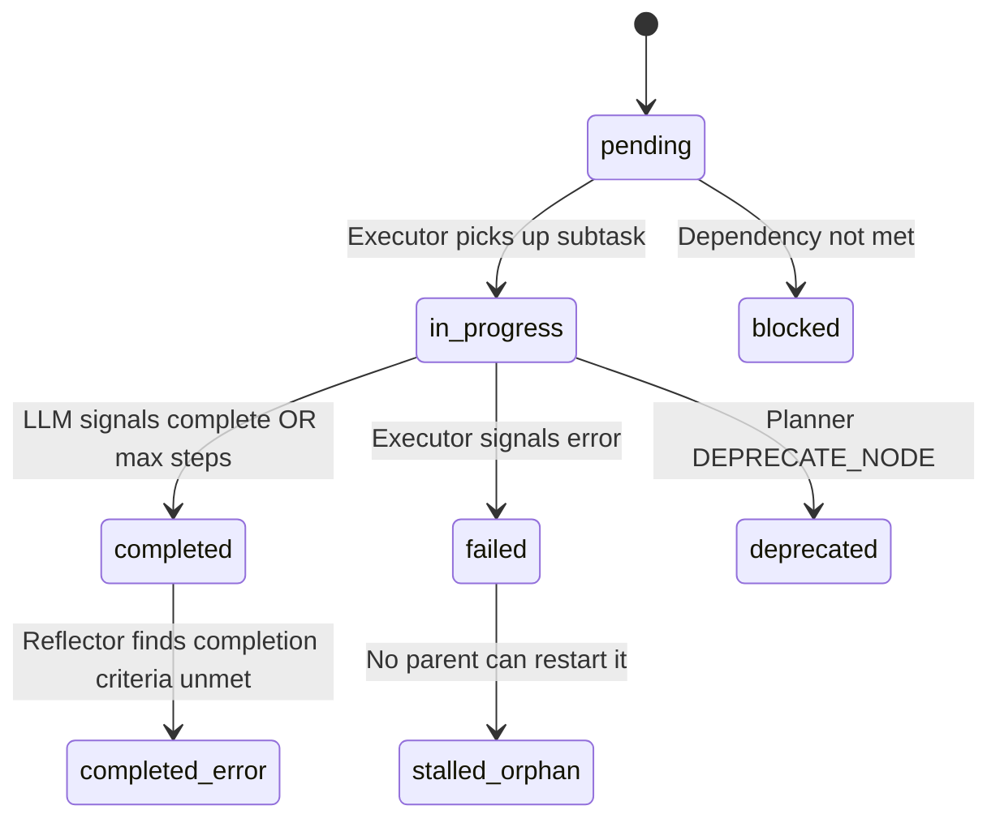

Traditional penetration testing automation uses a **linear task list**: step 1, step 2, step 3. When step 2 fails or reveals something unexpected, the entire list must be regenerated from scratch.

LuaN1aoAgent uses **Plan-on-Graph (PoG)** — a model where the penetration testing plan is a **Directed Acyclic Graph (DAG)** that evolves in real time. New findings grow the graph; dead ends prune it; parallel paths execute concurrently.

## Traditional Task List vs. Plan-on-Graph

| Feature | Traditional Task List | Plan-on-Graph |
|---|---|---|
| Structure | Linear list | Directed Acyclic Graph |
| Dependency management | Manual ordering | Topological auto-sorting |
| Parallel capability | None | Auto-identifies parallel paths |
| Dynamic adjustment | Regenerate entire plan | Local graph editing operations |
| Visualization | Difficult | Native support (Web UI) |
| Completed node protection | Not applicable | Immutable — `completed` nodes cannot be deprecated |

---

## The Task Graph

The task graph is a `networkx.DiGraph` managed by `GraphManager` in `core/graph_manager.py`. At the root sits the task node (representing the overall goal). Subtask nodes hang below it, and execution step nodes record individual tool calls under each subtask.

```python
class GraphManager:
    """
    Manages and maintains the task knowledge graph.
    Supports SQLite persistence.
    """
    def __init__(self, task_id: str, goal: str, op_id: Optional[str] = None):
        self.task_id = task_id
        self.graph = nx.DiGraph()         # Task planning graph
        self.causal_graph = nx.DiGraph()  # Separate causal reasoning graph
```

### Node Types in the Task Graph

<AccordionGroup>
  <Accordion title="task (root node)">
    Created once at initialization. Represents the entire mission.

    ```python
    node_data = {"type": "task", "goal": goal, "status": "in_progress"}
    self.graph.add_node(self.task_id, **node_data)
    ```
  </Accordion>
  <Accordion title="subtask">
    A discrete unit of work created by the Planner via `ADD_NODE`. Contains a full state machine and completion criteria.

    ```python
    # From GraphManager._build_subtask_payload
    {
        "type": "subtask",
        "description": description,
        "status": "pending",          # state machine
        "priority": priority,
        "reason": reason,
        "completion_criteria": completion_criteria,
        "staged_causal_nodes": [],
        "max_steps": max_steps,        # optional per-subtask step budget
    }
    ```
  </Accordion>
  <Accordion title="execution_step">
    A single tool call within a subtask. Created by the Executor.

    ```python
    # From GraphManager._build_execution_payload
    {
        "type": "execution_step",
        "parent": parent_id,
        "thought": thought,
        "action": action,              # {"tool": ..., "params": ...}
        "observation": None,
        "status": status,
        "sequence": self._execution_counter,
    }
    ```
  </Accordion>
  <Accordion title="staged_causal">
    A temporary node representing a causal node proposed by the Executor but not yet validated by the Reflector. Removed after reflection.
  </Accordion>
</AccordionGroup>

---

## Subtask State Machine

Every subtask node transitions through a defined set of states:



| Status | Meaning |
|---|---|
| `pending` | Awaiting execution; dependencies not yet met |
| `in_progress` | Currently being executed by the Executor |
| `completed` | Finished and verified by Reflector (**immutable**) |
| `failed` | Executor reported an error or max steps reached without success |
| `deprecated` | Planner abandoned this branch |
| `blocked` | A dependency subtask has failed, blocking this one |
| `stalled_orphan` | No parent can restart this node; it has no execution path |
| `completed_error` | Marked complete by Executor but Reflector found criteria unmet |

<Warning>
  Once a subtask reaches `completed` status, no Planner operation can change or deprecate it. The `_sanitize_graph_operations` method enforces this at the code layer and injects a violation warning back into the Planner's next context.
</Warning>

---

## Graph Operations

The Planner communicates with the task graph exclusively through structured **graph operations**, not natural language. This makes planning decisions inspectable, replayable, and safe to sanitize.

### ADD_NODE

```json
{
  "command": "ADD_NODE",
  "node_data": {
    "id": "subtask_mysql_bruteforce",
    "description": "Attempt MySQL login with empty root password",
    "dependencies": ["subtask_port_scan"],
    "priority": 2,
    "completion_criteria": "Achieved MySQL shell access or confirmed authentication required",
    "max_steps": 15
  }
}
```

### UPDATE_NODE

```json
{
  "command": "UPDATE_NODE",
  "node_id": "subtask_mysql_bruteforce",
  "updates": {
    "priority": 1,
    "completion_criteria": "Extracted at least one database table name"
  }
}
```

### DEPRECATE_NODE

```json
{
  "command": "DEPRECATE_NODE",
  "node_id": "subtask_mysql_bruteforce",
  "reason": "MySQL port is filtered, not open — confirmed by second scan"
}
```

<Note>
  `DEPRECATE_NODE` is semantically softer than `DELETE_NODE`. It marks a subtask as `deprecated` and retains it in the graph for audit and traceability. `DELETE_NODE` removes the node entirely.
</Note>

---

## Real-Time Adaptation Examples

PoG adapts to test findings without requiring full replanning.

<Steps>
  <Step title="New open ports discovered">
    The Executor finds ports 8080 and 8443 open that were not in the initial plan. The Planner receives this via the intelligence summary and issues `ADD_NODE` operations to mount new service-scanning subtasks as children of the port-scan node.
  </Step>
  <Step title="WAF detected">
    An Executor subtask reports HTTP 403 responses consistent with a WAF. The Planner issues `ADD_NODE` to insert WAF-fingerprinting and bypass-strategy subtasks before the original web-exploitation subtasks, adjusting their `dependencies` accordingly.
  </Step>
  <Step title="Attack path blocked">
    A subtask for exploiting a particular endpoint repeatedly fails. The Reflector marks it `failed`. The Planner calls `regenerate_branch_plan` to create an alternative subgraph that avoids the dead-end path.
  </Step>
  <Step title="Credentials discovered">
    A subtask discovers SSH credentials. The Planner adds new subtasks for SSH login, privilege escalation, and lateral movement — all depending on the credential-discovery subtask — without touching any existing nodes.
  </Step>
</Steps>

---

## Topological Dependency Management

Subtask dependencies create edges of type `"dependency"` in the graph. A subtask whose incoming `dependency` edges all point to `completed` nodes is eligible for execution.

```python
# From GraphManager.add_subtask_node
for dep_id in dependencies:
    if self.graph.has_node(dep_id):
        self.graph.add_edge(dep_id, subtask_id, type="dependency")
```

The `GraphManager` uses NetworkX's topological traversal to identify which subtasks are ready to run in parallel:

- Subtasks with the same set of completed predecessors are co-schedulable.
- The agent main loop dispatches co-schedulable subtasks to the Executor concurrently via `asyncio.gather`.

---

## Orphan Node Detection and Auto-Repair

An orphan node is a subtask whose dependency chain has been broken — all its predecessors have been deprecated or deleted, but the subtask itself remains `pending`. The GraphManager detects these as `stalled_orphan` nodes.

```python
# From GraphManager.get_failed_nodes
def get_failed_nodes(self) -> Dict[str, Any]:
    failed_nodes = {}
    for node_id, data in self.graph.nodes(data=True):
        if data.get("type") == "subtask" and data.get("status") in [
            "failed", "stalled_orphan", "completed_error"
        ]:
            failed_nodes[node_id] = data
    return failed_nodes
```

The Planner's `dynamic_plan` receives `stalled_orphan` nodes in `failed_tasks_summary` and treats them as high-priority items requiring diagnostic or alternative planning.

---

## Completed Node Protection

The `_sanitize_graph_operations` method in `core/planner.py` enforces an immutability guarantee for completed nodes at the code layer:

```python
# From core/planner.py
def _sanitize_graph_operations(
    self, ops: List[Dict], completed_node_ids: set = None
) -> List[Dict]:
    """
    Code-layer protection: prohibits any modification (including deprecation)
    of completed nodes. Violations are not silently dropped — they are
    recorded as warnings and injected into the next LLM context.
    """
    if node_id in protected_ids:
        if cmd in {"DELETE_NODE", "DEPRECATE_NODE"}:
            warning = {
                "error_code": "IMMUTABLE_STATUS_VIOLATION",
                "rejected_operation": op,
                "reason": (
                    f"Node '{node_id}' is in completed state (immutable historical fact), "
                    f"{cmd} operation is prohibited."
                ),
                "suggested_fix": (
                    f"Completed nodes cannot be deprecated. To extend this work, "
                    f"use ADD_NODE and reference '{node_id}' in dependencies."
                ),
            }
            self._last_sanitize_warnings.append(warning)
```

The set of completed node IDs is retrieved fresh each dynamic planning cycle:

```python
completed_ids = graph_manager.get_completed_node_ids() if graph_manager else set()
plan_data["graph_operations"] = self._sanitize_graph_operations(
    plan_data["graph_operations"], completed_node_ids=completed_ids
)
```

---

## The GraphManager Class

`GraphManager` is the single source of truth for all graph state. Its responsibilities:

<CardGroup cols={2}>
  <Card title="Task Graph Management">
    Maintains the planning DAG. Adds, updates, and deletes task and execution step nodes. Enforces parent-child relationships.
  </Card>
  <Card title="Causal Graph Storage">
    Maintains the separate causal reasoning graph. Applies tiered priority staging and promotes Reflector-approved nodes.
  </Card>
  <Card title="Topological Sorting">
    Identifies pending subtasks whose dependencies are all completed, enabling parallel scheduling.
  </Card>
  <Card title="Shared Bulletin Board">
    `shared_findings` list and per-subtask read cursors enable real-time cross-subtask discovery sharing without locks.
  </Card>
  <Card title="SQLite Persistence">
    Every graph mutation is asynchronously synced to SQLite via `schedule_coroutine`, enabling the Web UI to poll state and persist history across restarts.
  </Card>
  <Card title="Failure Pattern Analysis">
    `analyze_failure_patterns()` returns contradiction clusters, stalled hypotheses, and competing hypotheses to guide Planner replanning.
  </Card>
</CardGroup>

---

## Web Visualization

Because the task graph is a first-class data structure persisted in SQLite, the Web UI at `http://localhost:8088` can render it in real time:

- **Live graph evolution** — nodes appear and change state as the agent works.
- **Node detail view** — click any node to see its execution log, staged causal nodes, reflection report, and state history.
- **HITL intervention** — in Human-in-the-Loop mode, the Web UI presents plan approval modals and supports direct graph injection via the "Add Task" interface.
